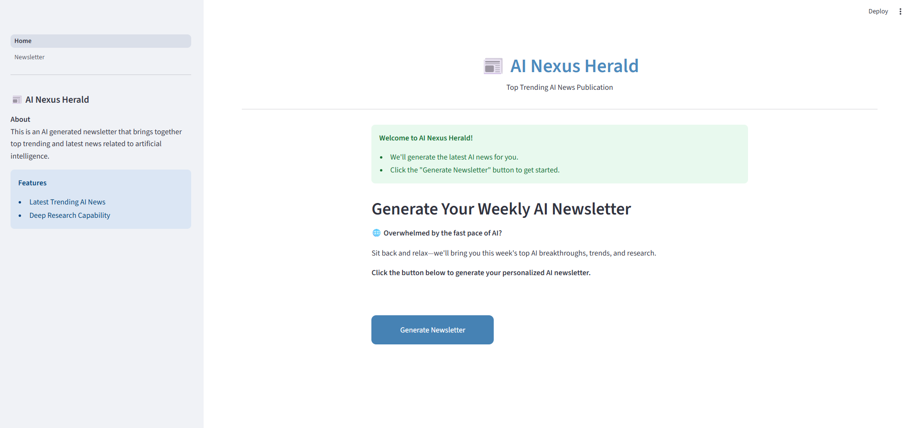

# AI Nexus Herald: A Multi-agent AI Newsletter Generator

## Overview
A modular and scalable muti-agent system powered by **Streamlit**, **LangGraph**, **FastAPI**, and **Groq LLM**. This solution shows multiple agents working together to generate an AI based newsletter featuring the top trending and latest AI news. It performs deep research to find trending topics in AI and news related to those topics, and synthesizes those news into a well-formed newsletter. 


## 🚀 Features
### Core Features
- ✅ **Latest Trending AI News** using RSS feed extraction tools
- ✅ **Multi-Agent System** using LangGraph for intelligent task coordination
- ✅ **Deep Research Capability** for diverse and relevant news aggregation
- ✅ **Structured Prompt Engine** via YAML for reproducible results
- ✅ **Groq API** for fast, low-latency inference
- ✅ **OpenAI API** for LLM evaluation
- ✅ **LangSmith Monitoring** for agent traceability and real-time observability
- ✅ **Guardrails Integration** for output validation (toxicity, prompt structure, etc.)
- ✅ **Evaluation with DeepEval** for quality assessment (clarity, relevance, faithfulness)
- ✅ **Extensible Modular Codebase** for research or production deployment


## Agents
1. 🤖 **Topic Finder Agent** - Searches the latest top trending topics in AI.
2. 🤖 **Deep Research Agent** - Performs in-depth search to find latest news about a given AI topic.
3. 🤖 **Newsletter Writer Agent** - Creates a well-formed newsletter summarizing and synthesizing all found AI news.
4. 🤖 **Orchestrator Agent** - Manages the coordination and workflow of all agents. 

## Tools
1. 🛠️ **RSS Title Extraction Tool** - To search trending AI topics (Custom tool)
2. 🛠️ **RSS News Extraction Tool** - To search news related to trending AI topics (Custom tool)
3. 🛠️ **Newsletter Saving Tool** - To save the newsletters in a directory (Custom tool)


## How It Works
### **Newsletter Generation**
1. User opens the Streamlit app and clicks the "Generate Newsletter" button.
2. Multiple agents get into action through LangGraph orchestration framework.
3. A well-structured AI Newsletter is generated and displayed to the user.

## Tech Stack
- 📊 Streamlit
- ⚡ FastAPI
- 🧬 LangGraph
- 🧠 GroqAPI (LLM)

## User Interface


## 🔧 Setup Instructions
### 1. Clone the repo
```sh
git clone https://github.com/aminajavaid30/ai_nexus_herald.git
cd ai_nexus_herald
```

### 2. Install dependencies
```sh
pip install -r requirements.txt
```

### 3. **Add your API keys** - Create a .env file with:
```sh
GROQ_API_KEY=...
OPENAI_API_KEY=...
LANGCHAIN_API_KEY=...
LANGCHAIN_TRACING_V2=true
LANGCHAIN_PROJECT="AI Nexus Herald"
```

### 4. Initialize the backend
Run the following command:
```sh
uvicorn src.backend.main:app --reload
```

### 5. Run the app
Navigate to the **frontend** folder and run the following command:
```sh
streamlit run Home.py
```

## Folder Structure
```sh
├── 📂 docs/ # Technical documentation
├── 📂 outputs/ # Generated newsletters and logs
├── 📂 resources/ # Static files like logos, images, etc.
├── 📂 src/
│ ├── 📂 backend/
│ │ ├── 📂 agents/
│ │ │ ├── deep_researcher.py # Gathers detailed insights on topics
│ │ │ ├── newsletter_writer.py # Composes newsletter content
│ │ │ ├── orchestrator.py # Coordinates multi-agent flow
│ │ │ └── topic_finder.py # Identifies trending AI topics
│ │ ├── 📂 config/
│ │ │ ├── config.yaml # System and service-level config
│ │ │ └── prompt_config.yaml # Prompt templates for LLM agents
│ │ │ └── rss_config.yaml # RSS feed URLs
│ │ ├── logger.py # Custom logging utility
│ │ ├── main.py # FastAPI backend entry point
│ │ ├── paths.py # Centralized path definitions
│ │ ├── prompt_builder.py # Builds structured prompts for agents
│ │ ├── tools.py # Custom tools for agents
│ │ └── utils.py # Utility functions
│ └── 📂 frontend/
│ ├──── 📂 pages/
│ │ ├──── 1 Newsletter.py # Streamlit UI for newsletter generation
│ ├──── Home.py # Streamlit app entry point
│ └──── style.css # Custom CSS styles
├── 📂 tests/
│ ├─── pytest.ini
│ ├─── test_topics.py
│ ├─── test_news.py
│ ├─── test_newsletter.py
│ ├─── test_topic_finder.py
│ ├─── test_deep_researcher.py
│ ├─── test_newsletter_writer.py
│ ├─── test_orchestrator.py 
├── .env # Environment variables
├── .gitignore # Git ignored files
├── LICENSE # Project license
├── README.md # Project documentation
└── requirements.txt # Python dependencies
```

## ✅ Evaluation & Testing

### 📊 DeepEval
We use [DeepEval](https://github.com/confident-ai/deepeval) to evaluate:
- Topic relevance to AI
- News selection relevance and faithfulness
- Newsletter structure, clarity, and tone.

### 🧪 Unit & Integration Testing
- Use `tests/` directory for Pytest-based testing using Deepeval.
- Sample script: `test_topics.py`, `test_news.py`


## 🛡️ Guardrails AI Integration

To ensure safety and robustness of the outputs, Guardrails is used to enforce:
- ❗ **Toxicity detection** (via GuardRails AI `ToxicLanguage`)
- ❌ On violation: Automatically abort


## 📡 LangSmith Monitoring

Monitor and trace each agent's execution in real-time using LangSmith:
- View traces for Topic Finder, Deep Researcher, and Writer agents
- Analyze token usage, latency, and failure points
- Debug LangGraph workflows visually


## License
MIT License

## Acknowledgements
Built as part of **AAIDC2025** - #AgenticAIDeveloperCertification2025 - using Streamlit, LangGraph, FastAPI, GROQ API, and OpenAI API.